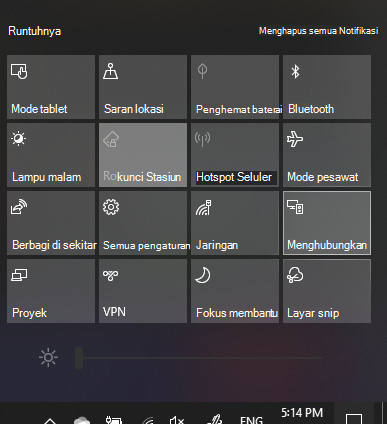

# Memproyeksikan ke PC

Pada perangkat tujuan Anda (memproyeksikan ke), Cari "pengaturan proyeksi" untuk membuka halaman pengaturan **memproyeksikan ke PC ini**. Kemudian pastikan bahwa:
- "Beberapa perangkat Windows dan Android bisa memproyeksikan ke PC ini saat Anda bilang itu OK" menu turun bawah diatur untuk **selalu nonaktif**.
- Menu turun bawah "minta proyek ke PC ini" diatur ke **setiap kali koneksi diperlukan**.
- Menu turun bawah "memerlukan SEMATKAN untuk pairing" diatur ke **tidak pernah**.

Di perangkat tujuan Anda, Luncurkan aplikasi **Sambungkan** dengan masuk ke **mulai** dan Cari "Sambungkan".

Lalu, di perangkat sumber Anda yang sedang mencoba memproyeksikan:

1. Tekan **tombol Windows + A** untuk membuka pusat tindakan.
2. Klik **Sambungkan**.
3. Klik perangkat tempat Anda ingin memproyeksikan layar.

Setelah langkah di atas, perangkat tujuan Anda harus menampilkan layar perangkat sumber seolah-olah merupakan monitor sekunder.
