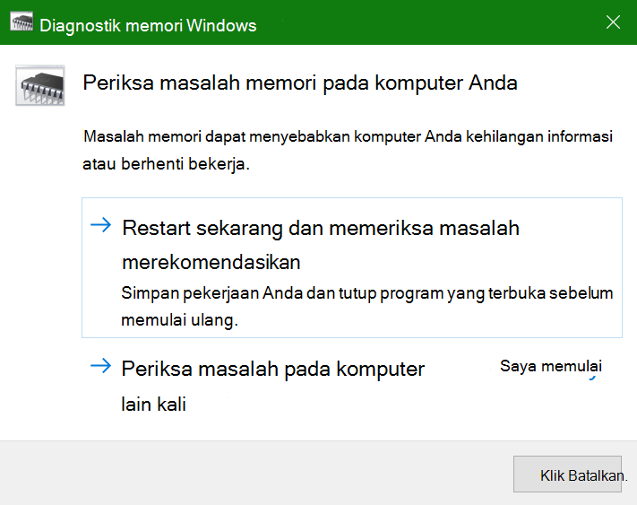

# Jalankan Windows Memory Diagnostics di Windows 10

Jika Windows dan aplikasi pada PC Anda menabrak, pembekuan, atau bertindak dengan cara yang tidak stabil, Anda mungkin memiliki masalah dengan memori PC (RAM). Anda dapat menjalankan Windows Memory Diagnostic untuk memeriksa masalah dengan RAM PC.

Di kotak pencarian pada taskbar, ketik **diagnostik memori**, dan kemudian pilih **Windows Memory Diagnostic**. 

Untuk menjalankan diagnostik, PC harus me-restart. Anda memiliki pilihan untuk me-restart segera (silahkan menyimpan pekerjaan Anda dan menutup dokumen terbuka dan e-mail pertama), atau menjadwalkan diagnostik untuk menjalankan secara otomatis pada saat PC restart berikutnya:

Ketika PC dimulai ulang, **alat diagnostik memori Windows** akan berjalan secara otomatis. Status dan kemajuan akan ditampilkan sebagai menjalankan diagnostik, dan Anda memiliki pilihan untuk membatalkan diagnostik dengan menekan tombol **ESC** pada keyboard Anda.

Ketika diagnostik selesai, Windows akan mulai normal.
Segera setelah restart, saat desktop muncul, pemberitahuan akan muncul (di sebelah ikon **Action Center** pada taskbar), untuk menunjukkan apakah ada kesalahan memori yang ditemukan. Misalnya:

Inilah ikon Action Center:  

Dan contoh pemberitahuan: 

Jika Anda melewatkan pemberitahuan, Anda dapat memilih ikon **pusat aksi** di taskbar untuk menampilkan **pusat aksi** dan melihat daftar pemberitahuan digulir.

Untuk meninjau informasi rinci, ketik **peristiwa** ke kotak pencarian di bilah tugas, dan kemudian pilih **peraga peristiwa**. Di panel sebelah kiri **penampil acara**, navigasikan ke **log Windows > sistem**. Di panel sebelah kanan, Pindai daftar sambil melihat kolom **sumber** , sampai Anda lihat peristiwa dengan nilai sumber **memorydiagnostics-hasil**. Sorot setiap acara tersebut dan lihat informasi hasil di kotak di bawah tab **umum** di bawah daftar.
